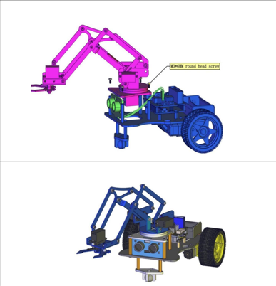
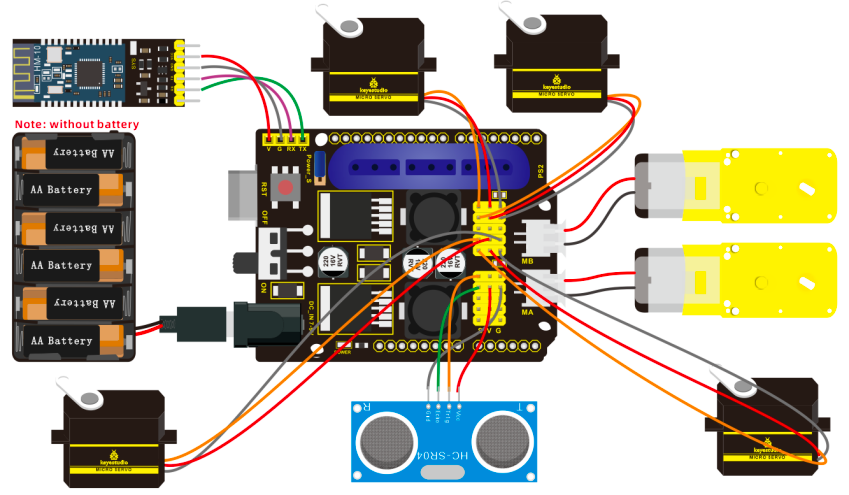

# 1. Description

Mechanical arm, featuring alike people’s arms, could execute a series of postures. At present, many mechanical arms are fixed style, which can’t be operated flexibly for environment and distance. On tackling this problem, KEYES group has launched a 3 in 1 learning kit-4DOF mechanical robotic arm car. With this kit, you could acquire how to control mechanical arm and smart car, what’s more, they can be combined to transform into mechanical arm smart car. I believe that you can’t help opening it to get started.

# 2. Features

3 in 1 Design: Smart car, mechanical arm, mechanical robot arm car Multi-purpose Function: obstacle avoidance, follow, IR remote control and automatic convey. Easy to Build: no soldering circuit required. High Tenacity: high performance car baseplate and metal mechanical arm High Extension: expand other sensors and modules through motor driver shield. Multiple Controls: PS2 joypad control, full automatic and App control(iOS and Android system)

Basic Programming：C language code learning.

# 3. Specification

- Working voltage: 5v 
- Input voltage: 7-12V 
- Maximum output current: 3A 
- Maximum power dissipation: 25W (T=75℃) 
- Motor speed: 5V 63 rpm / min 
- Motor drive form: TB6612 drive 
- Ultrasonic sensing angle: <15 degrees 
- Ultrasonic detection distance: 2cm-400cm 
- Bluetooth remote control distance: 20-50 meters (measured) 
- Bluetooth APP control: support Android and iOS system

## Docs

[Report (.pdf)](docs/Rapport.pdf)

## Resource

[Keyestudio](https://fs.keyestudiocom/KS0520)
